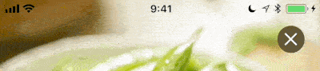

# Bartinter

Dynamically tints the iOS status bar to stay readable over the content behind it.



- iOS 15+ · Swift 6 · SPM
- No method swizzling
- Hybrid capture: GPU sampling via CARenderer + Metal on device, with an automatic `layer.render(in:)` CPU fallback (CARenderer is a no-op on the iOS simulator). Metal-backed Core Image averaging. Notch / Dynamic Island aware.
- Light/Dark mode correct (`.lightContent` / `.darkContent`)
- SwiftUI and UIKit APIs

## Install

Xcode → **File → Add Package Dependencies** → `https://github.com/MaximKotliar/Bartinter`

Set `UIViewControllerBasedStatusBarAppearance` to `YES` in Info.plist (the default).

## SwiftUI

```swift
ContentView()
    .tintsStatusBar()
```

With custom configuration or pause control:

```swift
// Custom threshold and sample rate
PhotoDetailView()
    .tintsStatusBar(Bartinter.Configuration(midPoint: 0.55, maxSampleRate: 30))

// Pause sampling while a video plays, preserve last tint
PlayerView()
    .tintsStatusBar(isActive: autoTint)
```

## UIKit — app-wide

Call once from your scene delegate; every screen benefits automatically:

```swift
func scene(_ scene: UIScene, willConnectTo session: UISceneSession,
           options: UIScene.ConnectionOptions) {
    guard let windowScene = scene as? UIWindowScene else { return }
    // … build window / root …
    Bartinter.install(in: windowScene)
}
```

## UIKit — per screen

For fine-grained control, own a `BartinterController` in each view controller:

```swift
final class GalleryViewController: UIViewController {
    private let bartinter = BartinterController()

    override var childForStatusBarStyle: UIViewController? { bartinter }

    override func viewDidLoad() {
        super.viewDidLoad()
        addChild(bartinter)
        bartinter.didMove(toParent: self)
        bartinter.tint(self)              // start sampling this screen
        bartinter.observe(collectionView) // re-sample on scroll (explicit opt-in)
    }
}
```

Container VCs must forward the query:

```swift
final class TintingNavigationController: UINavigationController {
    override var childForStatusBarStyle: UIViewController? { topViewController }
}
```

## Manual control

```swift
bartinter.setNeedsStatusBarTintUpdate() // force a re-sample on the next display-link tick
bartinter.isActive = false              // pause / resume sampling
let style = bartinter.currentStyle      // .lightContent or .darkContent
```

## Configuration

```swift
public struct Configuration {
    public var animationDuration: TimeInterval     // default: 0.2
    public var animationType: UIStatusBarAnimation // default: .fade
    public var midPoint: CGFloat                   // default: 0.6  — luminance threshold
    public var antiFlickRange: CGFloat             // default: 0.08 — hysteresis band
    public var maxSampleRate: Double               // default: 12   — samples/sec ceiling
}

// Change app-wide defaults once at launch (main actor):
Bartinter.Configuration.default.midPoint = 0.55
```

## Known limitation

Live server-composited content directly under the bar — an active `UIVisualEffectView` blur or an `AVPlayerLayer` video — is not captured. `CARenderer` (and `layer.render(in:)`) render the layer model tree, not the composited output. Status-bar-region content is almost always opaque backgrounds, images, or gradients, so this is rarely an issue in practice.

## Migration from 0.0.x

See [MIGRATION.md](MIGRATION.md).
